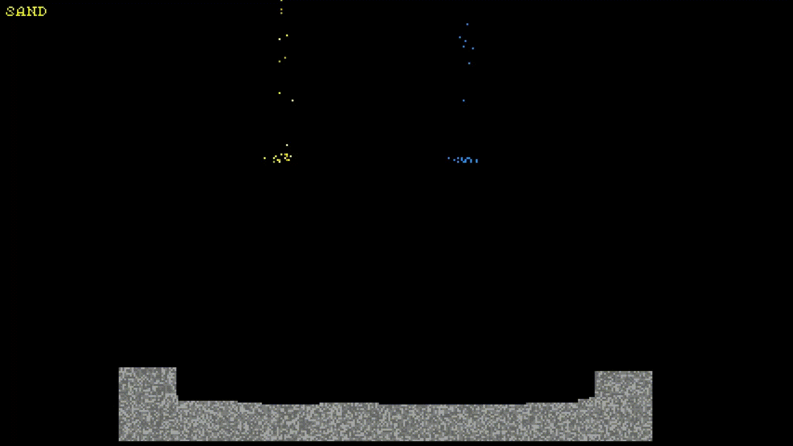
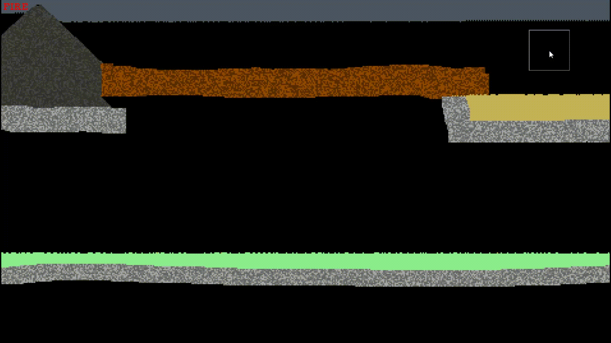

# Simple Sandbox Simulation | C++, SFML

A sandbox simulation inspired by the falling sand genre, written in C++ using SFML.

## Features
- Grid-based sandbox simulation
- Cellular automata-inspired interactions
- Rule-based material system
- Simple Powder/Liquid/Gas behavior
- Combustion system (burning materials)
- Acid corrodes materials

## Preview:
### Basic Mechanics

### Burning and Acid


## Controls

### Brush
- `Mouse Left Button` - Draw
- `Mouse Right Button` - Erase
- `Mouse Wheel` - Change Brush Size
- `Mouse Wheel + Left Shift` - Change Element

### Simulation
- `Delete` - Clear Board
- `Space` - Pause simulation
- `Right Arrow` - Render next frame (Only if paused)


## Build & Run:
- SFML is automatically fetched via CMake (FetchContent)
### Requirements:
- CMake 3.16+
- C++20 compatible compiler (GCC, Clang, MSVC)

> On Windows, Visual Studio C++ Build Tools (MSVC) may be required.

### Build:
```bash
git clone https://github.com/SewcioRex/cpp-sfml-falling-sand-sandbox.git
cd cpp-sfml-falling-sand-sandbox
cmake -B build
cmake --build build
```

> The first build may take a while because SFML is downloaded and built automatically.

### Run:
```bash
build/bin/sandbox.exe
```

###### OR

* Open `sandbox.exe` manually from the `build/bin` folder

## Notes:
- The project was created for educational purposes only.
- The project may evolve over time with new elements and architectural changes.
- The project uses the [Pixelated Elegance](https://ggbot.itch.io/pixelated-elegance-font) font.